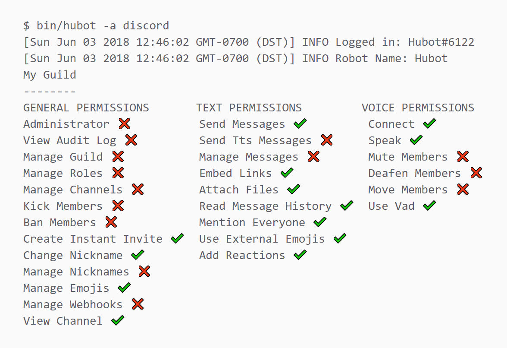

# hubot-discord-permissions


Want to know what havoc your Hubot can wreck? Output the permissions of your Discord Hubot to the console!

For every guild your Hubot is a member of, the script will output your Hubot's associated permissions in the format of Discord's OAuth permission selection screen.



## Installation

In hubot project repo, run:

`npm install hubot-discord-permissions --save`

Then add **hubot-discord-permissions** to your `external-scripts.json`:

```json
[
  "hubot-discord-permissions"
]
```

## NPM Module

https://www.npmjs.com/package/hubot-discord-permissions
